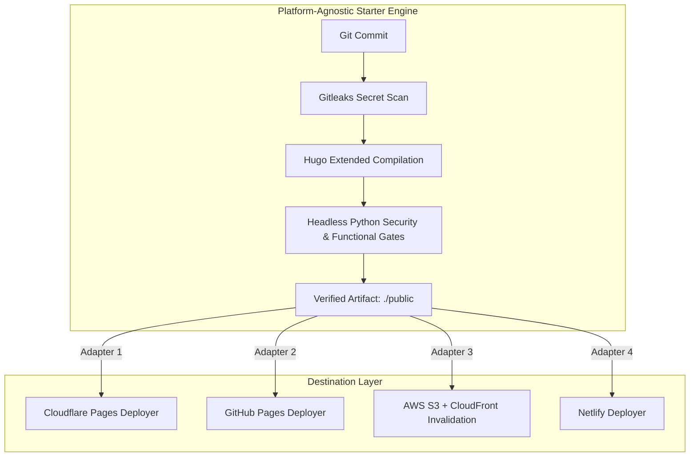

# 🛡️ Hugo DevSecOps Starter

> A platform-agnostic, zero-trust static publishing engine with automated Gitleaks scanning, headless Python security quality gates, and pluggable edge deployment adapters.

[](#-the-4-devsecops-quality-gates)
[](#gate-1-supply-chain--secret-scanning)
[](#gate-3-headless-python-security-quality-gates)
[](#local-development-quickstart)
[](LICENSE)

---

## 🧭 Why Hugo DevSecOps?

Traditional Content Management Systems (CMS) like WordPress or Drupal run monolithic application stacks: PHP interpreters, SQL databases, administrative user logins, and hundreds of third-party plugins. For technical blogs, research publications, and documentation portals, this architecture introduces a massive, unnecessary attack surface:
- **SQL Injection (SQLi)** and Broken Object-Level Authorization (BOLA).
- **Admin Credential Stuffing** and brute-force authentication attacks.
- **Supply-Chain Vulnerabilities** in dynamic server plugins.

**The Solution**: Treat publishing like an enterprise software release.
This starter compiles markdown into an immutable static bundle (`./public`), validates that output against automated security unit tests, and delivers it to edge CDNs with zero server-side runtime code.

---

## 🏛️ Architecture: Decoupled Core vs. Pluggable Adapters

A key design principle of this repository is **Provider Independence**:



The core verification workflow ([`.github/workflows/reusable-verify.yml`](.github/workflows/reusable-verify.yml)) contains **zero cloud provider tokens**. It produces a cryptographically verified static artifact bundle that can be deployed to any hosting target.

---

## 🛡️ The 4 DevSecOps Quality Gates

Every build is validated against 4 automated gates:

### Gate 1: Supply Chain & Secret Scanning
- **Engine**: [Gitleaks](https://github.com/gitleaks/gitleaks)
- Scans git history and commits for accidentally staged API keys, private tokens, RSA keys, and database passwords before Hugo is executed.

### Gate 2: Static Compilation & Garbage Collection
- **Engine**: Hugo Extended (`hugo --minify --gc --cleanDestinationDir`)
- Compiles markdown into minified, canonical HTML/CSS/JS with zero dead assets or stale build artifacts.

### Gate 3: Headless Python Security & Functional Gates
- **Engine**: Standalone Python 3.12 test harness (`tests/`) running against the compiled `./public` directory:
  - **Draft Containment** (`test_no_draft_leakage`): Asserts that markdown files with `draft: true` are never compiled into `public/`, leaked into `sitemap.xml`, or indexed in `index.json`.
  - **Future-Date Isolation** (`test_no_future_dated_posts_leakage`): Validates that scheduled posts (`publishDate > now`) are withheld until their release date when `buildFuture = false`.
  - **Local Path Sanitization** (`test_no_local_path_leakage`): Confirms no workstation paths (`C:\Users\...` or `/home/runner/...`) leak into the generated HTML.
  - **Subresource Integrity (SRI)** (`test_subresource_integrity_on_cdn_assets`): Verifies that external CDN scripts (e.g. KaTeX, Mermaid) enforce cryptographic SHA hashes.
  - **Tabnabbing Protection** (`test_external_links_tabnabbing_protection`): Ensures all `target="_blank"` links include `rel="noopener noreferrer"`.
  - **Sensitive File Elimination** (`test_no_sensitive_files_in_public`): Ensures `.env`, lock files, `.git`, or key files never end up in distribution.
  - **Edge Header Enforcement** (`test_edge_security_headers`): Validates presence of strict browser security headers.

### Gate 4: Edge Defense-in-Depth (`static/_headers`)
Pre-configured HTTP headers for Cloudflare Pages, Netlify, or edge proxies:
```http
/*
  X-Content-Type-Options: nosniff
  X-Frame-Options: SAMEORIGIN
  Content-Security-Policy: frame-ancestors 'self'
  Referrer-Policy: strict-origin-when-cross-origin
  Permissions-Policy: geolocation=(), camera=(), microphone=()
  Strict-Transport-Security: max-age=31536000; includeSubDomains; preload
```

---

## 🚀 Pluggable Deployment Adapters

Once the core gatekeeper passes, pick your preferred deployment destination:

### Adapter A: Cloudflare Pages
```yaml
deploy-cloudflare:
  needs: verify
  runs-on: ubuntu-latest
  steps:
    - uses: actions/download-artifact@v4
      with: { name: verified-public-site, path: public }
    - uses: cloudflare/wrangler-action@v3
      with:
        apiToken: ${{ secrets.CLOUDFLARE_API_TOKEN }}
        accountId: ${{ secrets.CLOUDFLARE_ACCOUNT_ID }}
        command: pages deploy public --project-name=my-site --commit-dirty=true
```

### Adapter B: GitHub Pages
```yaml
deploy-ghpages:
  needs: verify
  runs-on: ubuntu-latest
  permissions:
    pages: write
    id-token: write
  steps:
    - uses: actions/download-artifact@v4
      with: { name: verified-public-site, path: public }
    - uses: actions/upload-pages-artifact@v3
      with: { path: public }
    - uses: actions/deploy-pages@v4
```

### Adapter C: AWS S3 + CloudFront
```yaml
deploy-aws:
  needs: verify
  runs-on: ubuntu-latest
  steps:
    - uses: actions/download-artifact@v4
      with: { name: verified-public-site, path: public }
    - uses: aws-actions/configure-aws-credentials@v4
      with:
        aws-access-key-id: ${{ secrets.AWS_ACCESS_KEY_ID }}
        aws-secret-access-key: ${{ secrets.AWS_SECRET_ACCESS_KEY }}
        aws-region: us-east-1
    - run: aws s3 sync public/ s3://${{ secrets.S3_BUCKET_NAME }} --delete
    - run: aws cloudfront create-invalidation --distribution-id ${{ secrets.CLOUDFRONT_DISTRIBUTION_ID }} --paths "/*"
```

---

## 🔒 The Two-Tier Architecture: Keeping Drafts Private

If you maintain a private publication but want to use this public starter, you cannot use "private branches" (GitHub repository visibility is all-or-nothing). Instead, use the **Two-Tier Pattern**:

### Pattern 1: Git Upstream Remote (Recommended)
Add this public starter as an upstream remote inside your private authoring vault:
```bash
git remote add starter https://github.com/SixFiveMil/hugo-devsecops-starter.git
```
When updates are made to the starter's test harness or CI workflow, pull them into your private vault:
```bash
git fetch starter
git merge starter/main
```
Git cleanly merges updates to `tests/` and `.github/`, leaving your private `content/` drafts untouched.

### Pattern 2: Reusable GitHub Action (`workflow_call`)
In your private repo's `.github/workflows/deploy.yml`, simply invoke the public verifier:
```yaml
jobs:
  validate:
    uses: SixFiveMil/hugo-devsecops-starter/.github/workflows/reusable-verify.yml@main

  deploy:
    needs: validate
    # Your private deploy adapter here
```

---

## 💻 Local Development Quickstart

### 1. Prerequisites
- **Hugo Extended** (v0.128+ recommended)
- **Python 3.10+**
- **Git**

### 2. Local Preview
```bash
# Start local Hugo development server with drafts enabled
hugo server -D
```

### 3. Run Automated Security Quality Gates
```bash
# Build the site
hugo --minify --gc

# Run the 18-point DevSecOps test suite
python -m unittest discover -s tests -v
```

### 4. Scan for Secrets
```bash
gitleaks detect --source . --verbose
```

---

## 📄 License
This project is open-source under the [MIT License](LICENSE).
