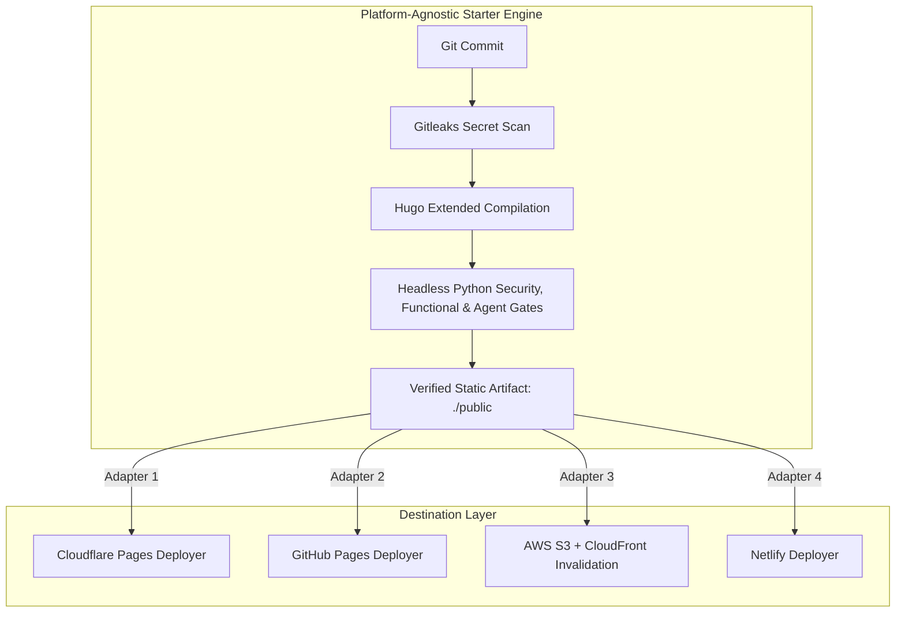

# 🛡️ Hugo DevSecOps Starter

> Universal, platform-agnostic, zero-trust static publishing engine with automated Gitleaks scanning, headless Python DevSecOps quality gates, shift-left CLI tooling, and pluggable edge deployment adapters.

[](#-the-5-devsecops-quality-pillars)
[](#gate-1-supply-chain--secret-scanning)
[](.github/dependabot.yml)
[](#-complete-universal-test-suite)
[](#-shift-left-cli-tooling)
[](#-local-development-quickstart)
[](LICENSE)

---

## 🧭 Why Hugo DevSecOps?

Traditional Content Management Systems (CMS) like WordPress or Drupal run monolithic application stacks: PHP interpreters, SQL databases, administrative user logins, and hundreds of third-party plugins. For technical blogs, research publications, and documentation portals, this architecture introduces a massive, unnecessary attack surface:
- **SQL Injection (SQLi)** and Broken Object-Level Authorization (BOLA).
- **Admin Credential Stuffing** and brute-force authentication attacks.
- **Supply-Chain Vulnerabilities** in dynamic server plugins.
- **Accidental Draft & Workstation Leakage** into publicly indexed assets.

**The Solution**: Treat static publishing like an enterprise software release.
This starter compiles markdown into an immutable static bundle (`./public`), validates that output against automated security, accessibility, and functional unit tests, and delivers it to edge CDNs with zero server-side runtime code.

---

## 🏛️ Architecture: Decoupled Core vs. Pluggable Adapters

A key design principle of this engine is **Provider Independence**:



The core verification workflow ([`.github/workflows/reusable-verify.yml`](.github/workflows/reusable-verify.yml)) contains **zero cloud provider tokens**. It produces a cryptographically verified static artifact bundle that can be deployed to any hosting target.

---

## 🛡️ The 5 DevSecOps Quality Pillars

Every build is validated against 5 automated quality pillars:

### 1. Static Purity & UDL Performance
- **Zero Heavy Framework Bloat**: Scans compiled HTML, JS, and layout templates to prohibit heavy client-side frameworks (React, Vue, jQuery, Angular, Svelte runtime).
- **Universal Design for Learning (UDL)**: Enforces lightweight vanilla HTML5/CSS and minimal progressive-enhancement JavaScript so content is 100% accessible on low-spec hardware and mobile networks.

### 2. DevSecOps Anti-Leakage & Staging Quarantine
- **Draft Containment** (`test_no_draft_leakage`): Asserts that markdown files with `draft: true` are never compiled into `public/`, leaked into `sitemap.xml`, or indexed in `index.json`.
- **Future-Date Isolation** (`test_no_future_dated_posts_leakage`): Validates scheduled posts (`publishDate > now`) remain withheld when `buildFuture = false`.
- **Local Path Sanitization** (`test_no_local_path_leakage`): Confirms no workstation paths (`C:\Users\...`, `/home/runner/...`, `/Users/...`) leak into generated HTML/JS/JSON/CSS artifacts.
- **Sensitive File Elimination** (`test_no_sensitive_files_in_public`): Guarantees `.env`, `.git`, `.lock`, private keys (`-----BEGIN KEY-----`), or config secrets never end up in distribution.
- **Editorial Quarantine** (`test_editorial_drafts_quarantine`): Quarantines `_distribution*`, staging notes, and vault sync buffers.

### 3. Accessibility & WCAG 2.1 AA Compliance
- **HTML5 Landmarks** (`test_landmark_html5_semantics`): Enforces `<header>`, `<nav>`, `<main>`, and `<footer>` semantic hierarchy on all viewable pages.
- **Keyboard Focus Indicators** (`test_focus_visible_css_present`): Requires visible `:focus-visible` CSS rules for keyboard navigation.
- **SEO & Single H1** (`test_seo_single_h1_per_page`): Restricts every non-redirect page to exactly one `<h1>`.
- **Accessible Imagery** (`test_seo_image_alt_attributes`): Requires non-empty `alt` attributes on all images.

### 4. Permalink & Citation Integrity (Zero Broken Links)
- **Baseline Slug Verification** (`test_canonical_slug_baseline_integrity`): Validates that 100% of URLs in `data/canonical_slugs.json` exist in the build.
- **Root-Relative Isolation** (`test_no_hardcoded_production_origin_in_templates`): Internal navigation in templates and markdown must use root-relative links (`/posts/` or `{{ .RelPermalink }}`), keeping staging/preview and local environments isolated from production.
- **Academic Citation Integrity** (`test_citation_identifier_formats`): Enforces standard formatting for DOI (`10.xxxx/...`) and ORCID identifiers.

### 5. Edge Defense-in-Depth & RFC 9116
- **Subresource Integrity (SRI)** (`test_subresource_integrity_on_cdn_assets`): Verifies external CDN assets enforce SHA hashes (`sha256-`, `sha384-`, `sha512-`) with `crossorigin="anonymous"`.
- **Tabnabbing Protection** (`test_external_links_tabnabbing_protection`): Ensures all `target="_blank"` links enforce `rel="noopener noreferrer"`.
- **RFC 9116 Compliance** (`test_security_txt_rfc9116`): Validates `.well-known/security.txt` has a valid `Contact:` URI and future `Expires:` timestamp.
- **Security Headers** (`test_edge_security_headers`): Enforces pre-configured HTTP security headers:
  ```http
  /*
    X-Content-Type-Options: nosniff
    X-Frame-Options: SAMEORIGIN
    Content-Security-Policy: frame-ancestors 'self'
    Referrer-Policy: strict-origin-when-cross-origin
    Permissions-Policy: geolocation=(), camera=(), microphone=()
    Strict-Transport-Security: max-age=31536000; includeSubDomains; preload
  ```

---

## 🧪 Complete Universal Test Suite

The test harness in `tests/` is fully modular and dynamically configurable:

| Module | Purpose | Key Tests |
|---|---|---|
| [`tests/test_security.py`](tests/test_security.py) | Anti-leakage, SRI, XSS, tabnabbing, headers | `test_no_draft_leakage`, `test_no_future_dated_posts_leakage`, `test_no_local_path_leakage`, `test_subresource_integrity_on_cdn_assets`, `test_edge_security_headers`, `test_security_txt_rfc9116` |
| [`tests/test_functional.py`](tests/test_functional.py) | HTML semantic structure, SEO, sitemaps, RSS | `test_html_document_structure`, `test_viewport_meta_responsive`, `test_seo_single_h1_per_page`, `test_canonical_links`, `test_internal_links_and_assets`, `test_sitemap_xml`, `test_rss_feed_xml` |
| [`tests/test_agent_rules.py`](tests/test_agent_rules.py) | AGENTS.md rules, static purity, landmarks, baseline slugs | `test_static_purity_no_heavy_js_frameworks`, `test_landmark_html5_semantics`, `test_focus_visible_css_present`, `test_canonical_slug_baseline_integrity`, `test_no_hardcoded_production_origin_in_templates` |
| [`tests/test_utils.py`](tests/test_utils.py) | Dynamic config discovery, DOM parsing, caching | Auto-detects `hugo.toml`, `.devsecops.json`, `data/canonical_slugs.json`, parses HTML AST |

---

## ⚡ Shift-Left CLI Tooling

Catch regressions and vulnerabilities on your local machine *before* pushing to git:

### 1. One-Command Full Verification Runner
Run secret scans, Hugo compilation, and the full DevSecOps test harness:
```bash
python scripts/verify.py
```

Options:
- `python scripts/verify.py -v`: Enable verbose test execution output.
- `python scripts/verify.py --skip-gitleaks`: Skip local Gitleaks check (if not installed locally).
- `python scripts/verify.py --skip-hugo`: Run tests against existing `public/` directory.

### 2. Automatic Pre-Push Git Hook
Install the turnkey pre-push hook to automatically block any failing push:
```bash
python scripts/install_git_hooks.py
```

Now, every time you run `git push`, the entire DevSecOps test engine runs locally. If a draft leaks or a broken link is introduced, the push is safely aborted.

---

## 🚀 1-Line Reusable CI Integration

Adopt this entire DevSecOps engine into any private or public Hugo repository using GitHub Actions:

### 1. Reusable Workflow Caller
Create `.github/workflows/deploy.yml` in your repository:

```yaml
name: Production Release Pipeline

on:
  push:
    branches: [main, master]

jobs:
  # 1-Line DevSecOps Verification Gate
  verify:
    uses: SixFiveMil/hugo-devsecops-starter/.github/workflows/reusable-verify.yml@main
    secrets: inherit

  # Pluggable Deployment Adapter (runs only if 100% of gates pass)
  deploy:
    needs: verify
    runs-on: ubuntu-latest
    steps:
      - name: Download Verified Static Artifact
        uses: actions/download-artifact@v4
        with:
          name: verified-public-site
          path: public/
      
      # Example: Deploy to Cloudflare Pages
      - name: Deploy to Cloudflare Pages
        uses: cloudflare/wrangler-action@v3
        with:
          apiToken: ${{ secrets.CLOUDFLARE_API_TOKEN }}
          accountId: ${{ secrets.CLOUDFLARE_ACCOUNT_ID }}
          command: pages deploy public --project-name=my-site --commit-dirty=true
```

### 2. Automated Supply-Chain Security (Dependabot)

The starter ships with a pre-configured [`.github/dependabot.yml`](.github/dependabot.yml) to automate vulnerability patching and continuous maintenance:
- **GitHub Actions Ecosystem**: Weekly automated updates for all actions in `.github/workflows/`, grouped into a single unified PR to eliminate alert fatigue.
- **Git Submodules Ecosystem**: Automatically tracks upstream releases and security patches for Hugo themes residing in `themes/*`.
- **Zero-Trust Gated Validation**: Dependabot PRs run under restricted read-only permissions and must pass 100% of the 33+ headless Python DevSecOps test gates and Gitleaks scans before merge approval.

### 3. Automated Semantic Versioning & Release Tagging

When merging changes from `develop` into `main`, [`.github/workflows/release.yml`](.github/workflows/release.yml) automatically:
- **Analyzes Conventional Commits**: Computes semantic version increments (`feat:` → minor, `fix:` / `chore:` / `chore(deps-actions):` → patch, `BREAKING CHANGE:` → major).
- **Creates Annotated Git Tags**: Publishes `vX.Y.Z` tags and updates floating major version pointers (e.g., `v1`).
- **Publishes GitHub Releases**: Automatically generates release notes and categorized changelogs for downstream dependency tracking.

---

## ⚙️ Configuration & Customization

The test engine automatically adapts to your site settings, with optional configuration overrides:

### 1. Standard `hugo.toml`
The engine automatically extracts `baseURL`, `title`, `locale`, `buildDrafts`, and `buildFuture` from `hugo.toml`.

### 2. Optional `.devsecops.json` (or `data/devsecops.json`)
Override or extend security rules:
```json
{
  "canonical_domain": "example.com",
  "cdn_domains": [
    "cdnjs.cloudflare.com",
    "cdn.jsdelivr.net",
    "unpkg.com"
  ],
  "banned_js_frameworks": [
    "react",
    "react-dom",
    "vue",
    "angular",
    "jquery"
  ],
  "require_security_txt": true,
  "require_edge_headers": true
}
```

### 3. Baseline Slugs (`data/canonical_slugs.json`)
Protect your search rankings and citations by enforcing a baseline of permanent slugs:
```json
[
  "hello-devsecops",
  "posts/getting-started",
  "about"
]
```

---

## 💻 Local Development Quickstart

```bash
# 1. Clone repository
git clone https://github.com/SixFiveMil/hugo-devsecops-starter.git
cd hugo-devsecops-starter

# 2. Install pre-push hooks
python scripts/install_git_hooks.py

# 3. Start local development server
hugo server -D

# 4. Run full DevSecOps verification
python scripts/verify.py
```

---

## 🌐 Production Provenance

This engine was extracted and generalized from the production DevSecOps and release architecture powering [Code and Cypher](https://codeandcypher.com/), an enterprise cybersecurity and cryptography research publication by Joshua A. Wortz.

---

## 📄 License
This project is open-source under the [MIT License](LICENSE).
